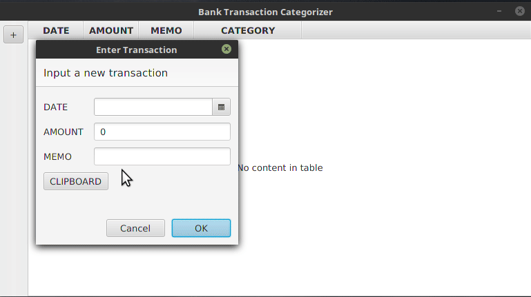

# Naive Bayes User Input Prediction

This is a simple [Kotlin](http://kotlinlang.org/) application that leverages Naive Bayes to categorize bank transactions.

NOTE: [Kotlin-Statistics](https://github.com/thomasnield/kotlin-statistics#naive-bayes-classifier) now has this feature in an easy-to-use API. 

Input and categorize a few transactions, and the simple AI will start to predict the categories once it picks up probabilities for given keywords.

Chapter 13 of [O'Reilly Data Science From Scratch](http://a.co/i6i5wEX ) by Joel Grus was a useful reference. 

Here is a recorded demo. The first three transactions did not have enough data to predict. But after the fourth transaction, the algorithm starts to make accurate predictions.

